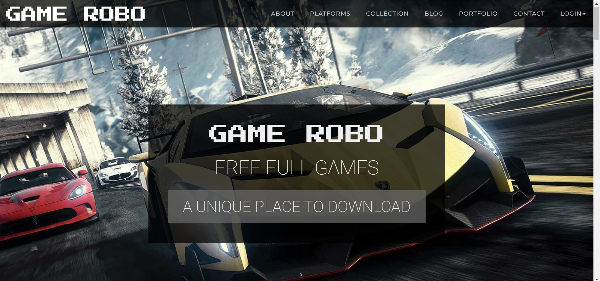
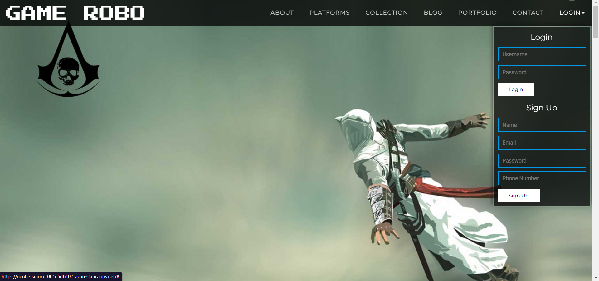
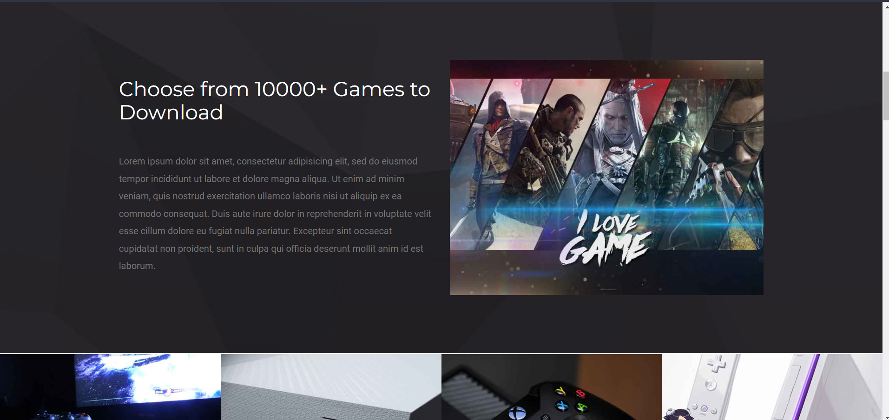
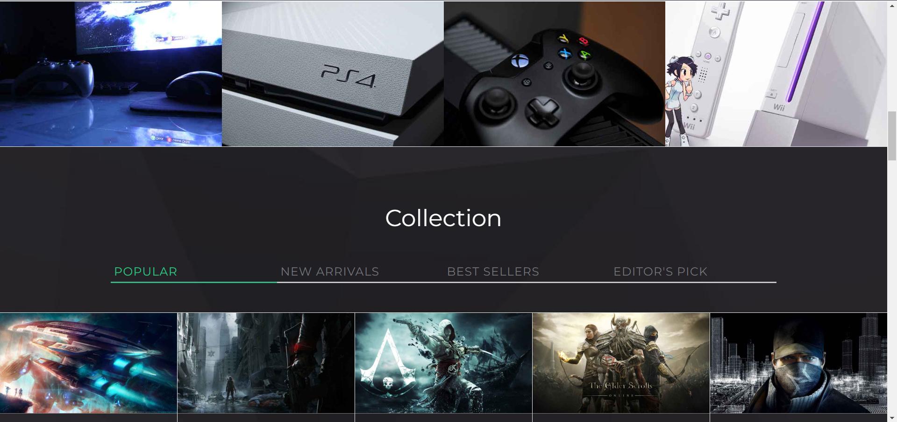
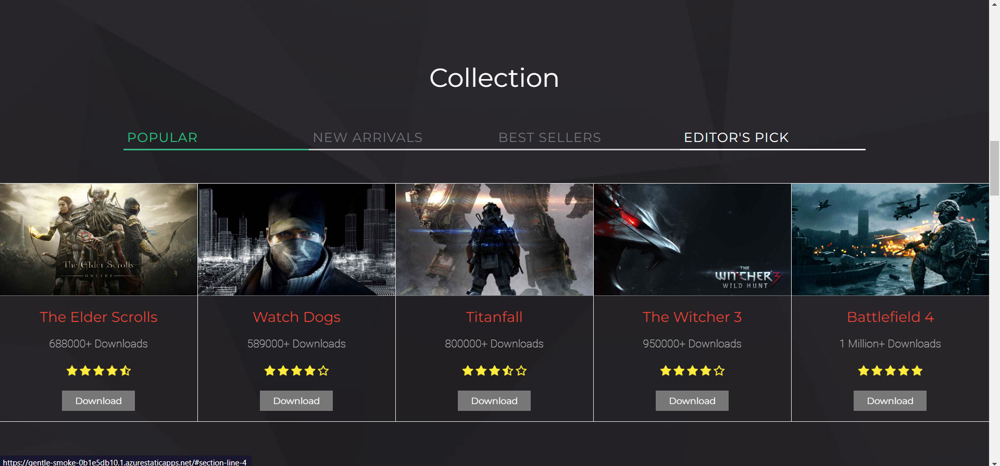
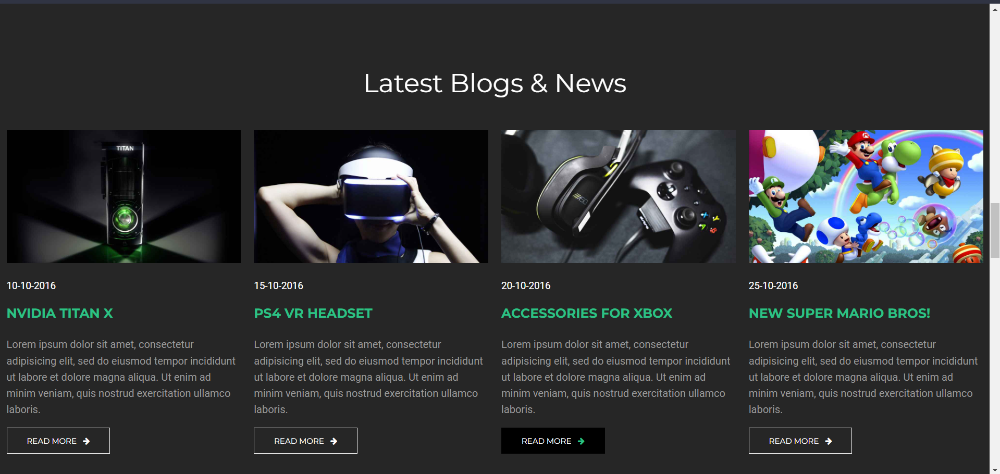
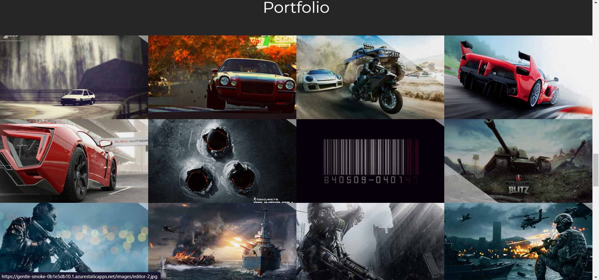
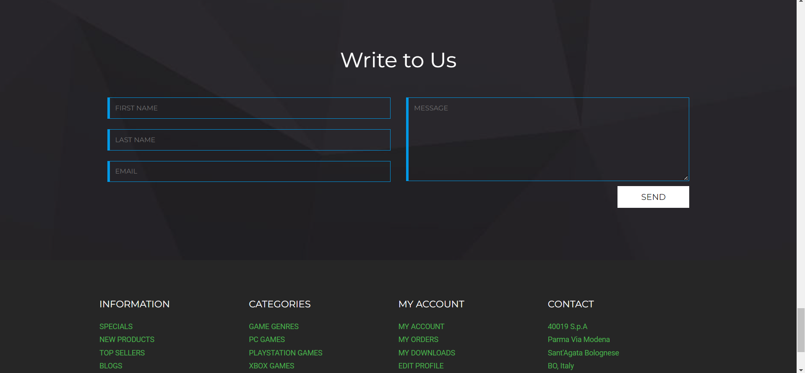
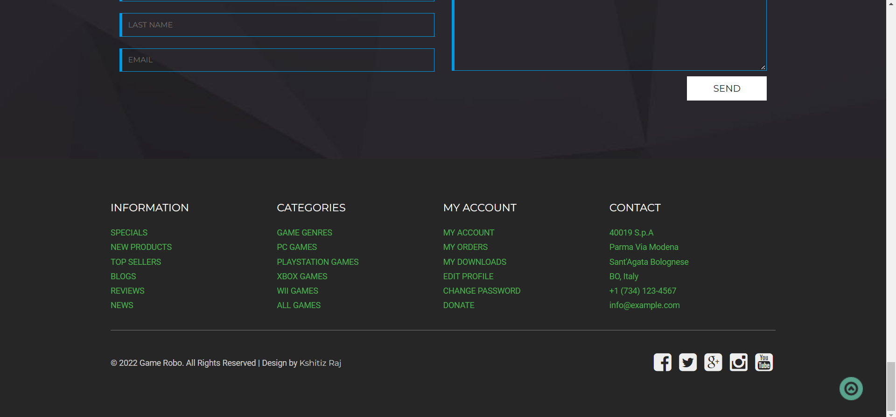

# ✨ Game Robo Website  ✨

This is a web based application developed for games lovers named Game Robo.

### This web based game download platform has been developed for the accomplishment of Future Ready Talent Internship program launched by Microsoft, Future Skills Prime, Quess, Github and EY.

**Project Link** - https://gentle-smoke-0b1e5db10.1.azurestaticapps.net

**Demo Video** -  https://drive.google.com/file/d/1s4w-DwlSdUZBWnWC2837cyU45_g-n1rH/view?usp=sharing

## Features and Functionalities 😃

- Interactive and responsive UI.
- Has many graphical and visual innovative effects.
- Have an aesthetically pleasing visual design and architecture.
- Has many sections of web pages including Home, About, Platforms, Collection, Blog, Portfolio, Contact and login.
- User is able to download free games very easily through the website.
- Included the feedback Survey form to increase the scope of improvement 

## Screenshots 📸
### Home  -   

### Login  -   

### About  -   

### Platforms  -   

### Collection  -   

### Blog  -   

### Portfolio  -   

### Contact  -   

### Bottom Screen  -   

## Tech Stack 💻

- [Azure(Hosting)](https://azure.microsoft.com/en-in/features/azure-portal/)
- HTML
- CSS
- JavaScript
